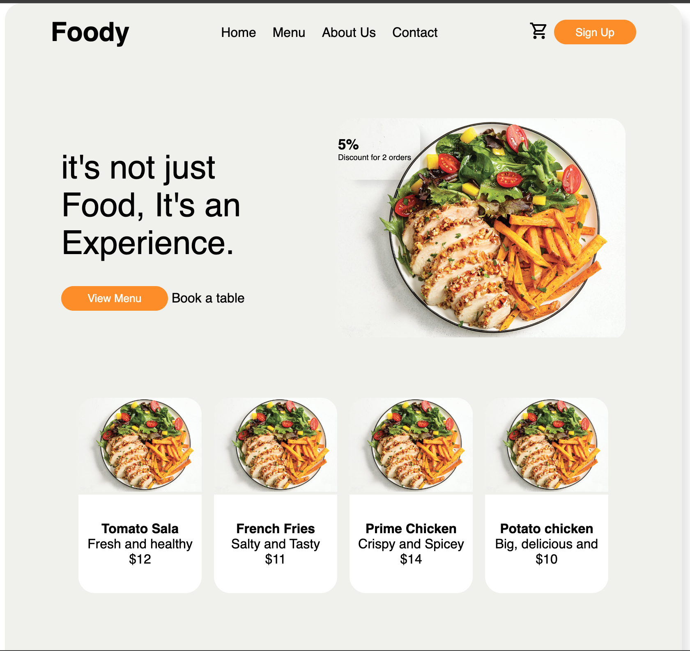

# Restaurante Page

## Table of contents

- [Overview](#overview)
  - [The challenge](#the-challenge)
  - [Screenshots](#screenshots)
  - [Links](#links)
- [My process](#my-process)
  - [Built with](#built-with)
  - [What I learned](#what-i-learned)
  - [Continued development](#continued-development)
  - [Useful resources](#useful-resources)
- [Author](#author)

## Overview

### The challenge

Users should be able to:

- View a list of cards on the main page;
- See a big card on the main page;
- Select an option from the menu;
- Transition between pages without requesting form a server;
- See a list of foods in the menu page;

### Screenshots



### Layout design credit

- Tazrin: [Dribbble progile](https://dribbble.com/tazrinasha)

### Links

- Solution URL: [GithHub Repository](https://github.com/danielrsouza10/restaurant-page-js)
- Live Site URL: [Restaurante Page](https://danielrsouza10.github.io/restaurante-page-js/)

## My process

### Built with

- Semantic HTML5 markup
- CSS custom properties
- Flexbox
- Javascript Factory Functions and Module Pattern

### What I learned

Improved the manipulation of the DOM with JavaScript.
Improve Factory Functions on JavaScript.

```js
function menuBar() {
  return `
    <div class="menu-bar">
        <h1 >Foody</h1>
        <ul class='menu-links'>
            <li><a href="#" id="home">Home</a></li>
            <li><a href="#" id="menu">Menu</a></li>
            <li><a href="#">About Us</a></li>
            <li><a href="#">Contact</a></li>
        </ul>
        <div class="menu-bar__buttons">
          <a hred="#"><span class="material-symbols-outlined">
          shopping_cart
          </span></a>
          <button type="button">Sign Up</button>
        </div>
    </div>
  `;
}

export default menuBar;
```

```js
function bigcard() {
  return `
    <div class="big-card">
        <div class="big-card__left">
            <div class="bid-card__title">
                <span>it's not just Food, It's an Experience.</span>
            </div>
            <div class="bid-card__buttons">
                <button type="button">View Menu</button>
                <span><a href="#">Book a table</a></span>
            </div>
        </div>
        <div class="big-card__right">
            <div class="big-card__discount-tag">
                <div class="discount-card">
                    <span class="discount-percentage">5%</span>
                    <span>Discount for 2 orders</span>
                </div>
            </div>
            <div class="big-card__image">
                
            </div>
        </div>
    </div>
`;
}
export default bigcard;
```

### Continued development

Make a list of interactive options from the menu;
Add some style when the user interact with links and options;
Implement the cart menu for orders;
Request and api for new foods.

### Useful resources

- [The Odin Project](https://www.theodinproject.com) - This helped me for Modules.

## Author

- Website - [Linkedin](https://www.linkedin.com/in/danielrsouza/)
- Instagram - [@danielrsouza](https://www.instagram.com/danielrsouza)

This is a solution to the [Restaurante Page](https://www.theodinproject.com/lessons/node-path-javascript-restaurant-page).
